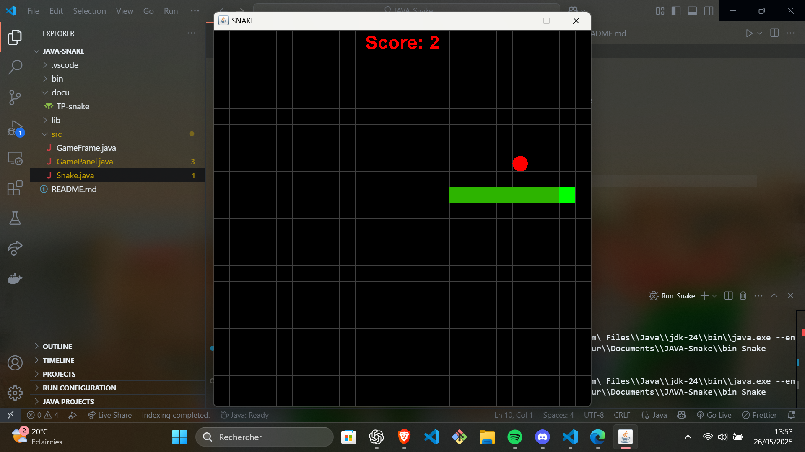
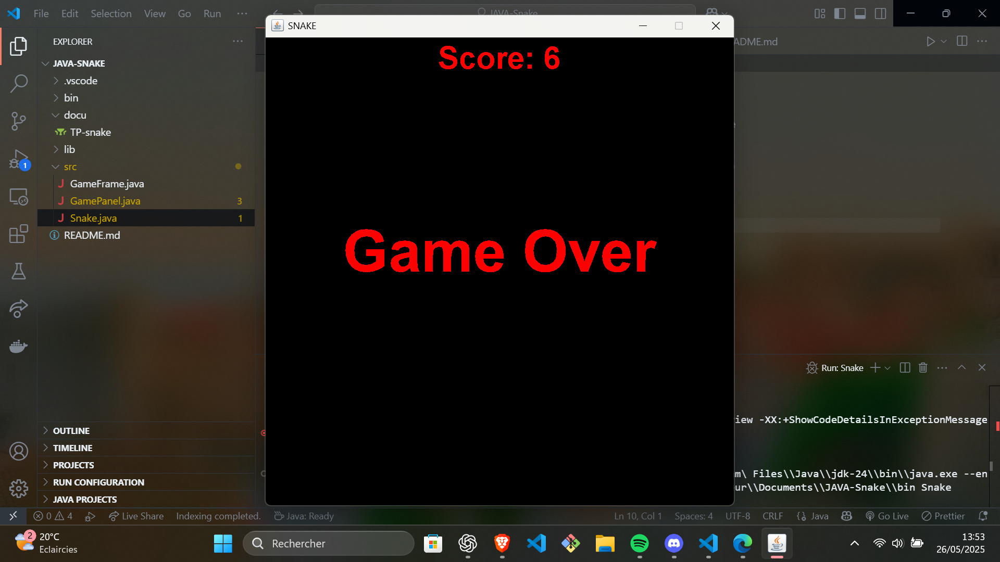

# 🎯 Jeu Snake – Projet Java Swing

Bienvenue dans ce projet de développement d’un jeu Snake en Java Swing, réalisé dans le cadre de ma formation en développement fullstack Java.  
Ce projet permet de mettre en pratique la gestion d’événements clavier, la gestion des collisions, et l’affichage graphique avec Swing.

---

## 🚀 Présentation

Le jeu Snake est une application classique où le joueur contrôle un serpent se déplaçant sur une grille, avec pour objectif de manger des pommes qui apparaissent aléatoirement.  
Le serpent grandit à chaque pomme consommée, et le jeu se termine si le serpent entre en collision avec lui-même ou les limites du terrain.

---

## 🕹️ Fonctionnalités

- 🎮 Gestion des événements clavier pour déplacer le serpent (flèches directionnelles)  
- 💥 Gestion des collisions avec le corps du serpent et les murs  
- 🏆 Calcul et affichage du score  
- 🎨 Affichage graphique du serpent et de la pomme avec Swing  
- ⏱️ Timer pour gérer la boucle de jeu et rafraîchir l’écran  
- 🧩 Architecture modulaire avec classes distinctes : `Snake`, `GameFrame`, `GamePanel`

---

## 🛠️ Stack technique

| Technologie              | Rôle                                            |
|-------------------------|-------------------------------------------------|
| Java 24                 | Langage principal                               |
| Swing                   | Interface graphique (fenêtre, dessin, événements) |
| AWT                     | Gestion des événements clavier et graphiques   |
| Timer (javax.swing)     | Gestion du cycle de jeu                         |

---

## 🛠️ Installation et exécution

1. Cloner le dépôt GitHub  
2. Compiler les fichiers Java (`Snake.java`, `GameFrame.java`, `GamePanel.java`)  
3. Lancer la classe principale `Snake`  

```bash
javac *.java
java Snake
```
---

## 📌 Auteur

👨‍💻 **Quentin** – Étudiant développeur Fullstack Java  
🎓 Projet réalisé dans le cadre de ma formation en développement Java  
🎯 Rôle principal : conception et développement complet du jeu Snake, gestion graphique et événements clavier  

📆 Projet – Mai 2025

---

## 📸 Captures d’écran

Voici quelques captures du jeu en fonctionnement :

  
*Vue principale du jeu avec serpent et pomme*

  
*Écran affiché lors de la fin de partie (Game Over)*


